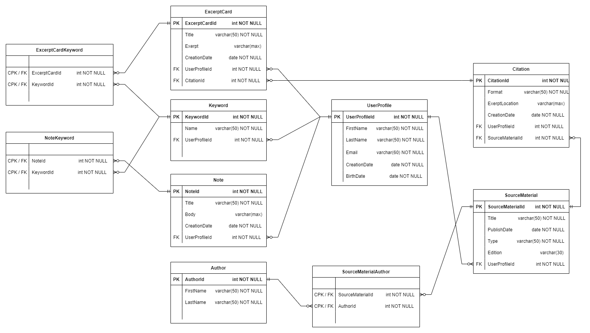

# Database Documentation

The purpose of this database is to be a store of information in the form of notes and index cards collected by users doing research in any variety of field.

**Note:** Diagrams and documentation are subject to change. At this early stage the material is largely scratchwork. As the design matures more formalized documentation will be available.

## Tables and Table Structures

### Database Entity Relationship Diagram

**TODO** add NoteNoteConnection, NoteIndexConnection, IndexIndexConnection tables for more arbitrary connection functionality.
each of these tables would have their associative IDs, and a short text body describing the conection of ideas.

**or** could make one Connection table, attributes would be NoteId, IndexCardId, RelatedNoteId, RelatedIndexCardId, TextBody.

-   establish rule that a connection can only be made between two entities per record, and whichever one is not present (RelatedNoteId, RelatedIndexCardId) is NULL.
